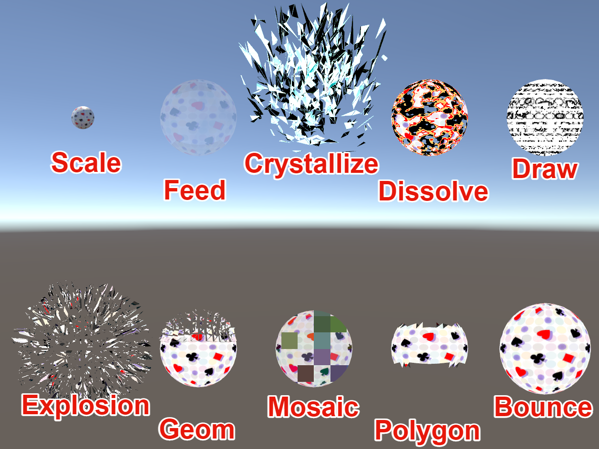

# MagicDresserInventorySystem

! [alt](./Manual/000.png)
This is a configuration tool that allows VRChat avatars to switch in and out of items and clothes from the menu.
It is also possible to generate effects when switching clothes with a simple configuration.

## Import Method
1. Make a backup of your avatar upload project in advance.
2. Update VRCSDK3-AVATAR to the latest version.
3. Import the MechanicalDresserInventorySystem.unitypackage into UnityProject.
4. Open Window/HotateA/MagicDresserInventorySystem in the top menu of Unity.
5. Drag and drop an avatar object on the scene into the "Avatar" field.
6. Add a menu to "MenuElements".
7. The left side of the window, menu items are configured.
    - Name
    - Icon
    - Toggle / Layer (exclusive mode) : If set to Layer, one menu in the same layer will be active.
    - is Saved : Whether the state is preserved when switching avatars
    - is Default : Whether it is enabled by default or not.
8. On the right side of the window, configure the item.
   Drag and drop the objects you want to put in and out of the menu.
    - ON State : Set the animation when the menu is turned ON.
        - IsActive : Enable/disable the item when the menu is turned on.
        - delay : Lag time between turning on the menu and enabling/disabling the item.
        - duration : time taken for the animation to enable/disable the item
        - type : type of animation to enable/disable the item
            - None : no animation (duration is ignored)
            - Scale : Animation of the object appearing larger (only supported by MeshRenderer)
            - Shader : Animation using any shader (the value of "_AnimationTime" changes from 0 to 1)
            - Feed : Animation to increase transparency and disappear
            - Crystallize : Animation of polygons shattering
            - Dissolve : animation of burning out
            - Draw : Pencil coloring animation
            - Explosion: Animation of a polygon exploding
            - Geom : Animation of geometry decomposition
            - Mosaic : Animation of a mosaic that becomes finer and finer
            - Polygon : Animation of polygon decomposition
            - Bounce : Animation of an object growing in size
    - OFF State : Animation setting when menu is OFF
9. Press the "Setup" button.
10. Upload your avatar in the usual way.

11. In the Project window, double-click the file saved during Setup to resume the setup 🐈.

## How to use
1. Select "MagicDresserInventorySystem" from Avatar's ExpressionMenu.
2. By selecting the toggle menu, you can switch between itemsฅ(＾ω・＾ฅ)

## Uninstallation procedure
### v1.27 or later
 1. Press the "Force Revert" button from the "Modify Options" option of the tool.
 2. Success if the message "Status : Complete Revert" appears.
### Before v1.26
1. Delete layers with names starting with "MDInventory_" from Fx_Animator.
2. Delete items with names beginning with "MDInventory_" from VRCExpressionsMenu.
3. VRCExpressionParameters Deletes entries with names beginning with "MDInventory_".

## Modify Options
- Override Write Default : Override the value of WriteDefault. (VRChat deprecated item)
- RenameParameters : Hash and remove 2-byte characters in parameter names.
- Auto Next Page : When the number of menu items reaches the limit, the next page is automatically created.

- Force Revert : Revert the settings set up by this tool.

- Override Animation On Idle State : Loop the animation that is always synchronized. (For stable behavior in VRChat).
- Override Default Value Animation : Override the default values for materials.

## Caution.
- This is a destructive change to fxAnimatorController, ExpressionMenu, and ExpressionParameters of the avatar. Please remember to make a backup copy of your avatar.
- If the maximum number of items in ExpressionParameters and ExpressionMenu has been reached, you may not be able to successfully introduce them. In such cases, please reduce the number of items temporarily.
- If an error occurs due to a conflict with a previous version, please try FullPackage.
- If you are controlling OnOff of the object by animation outside of this tool, it may not work properly. (DetectConflictLayer is displayed during "Setup").
