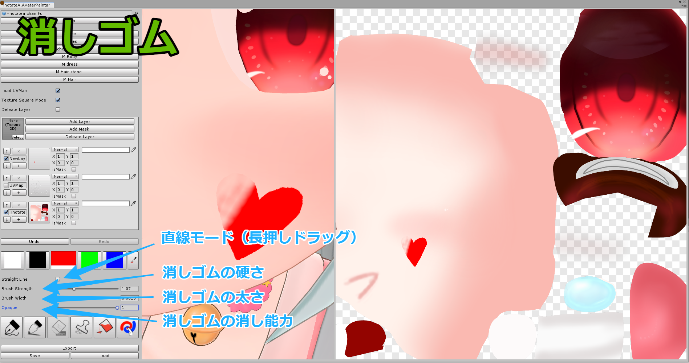
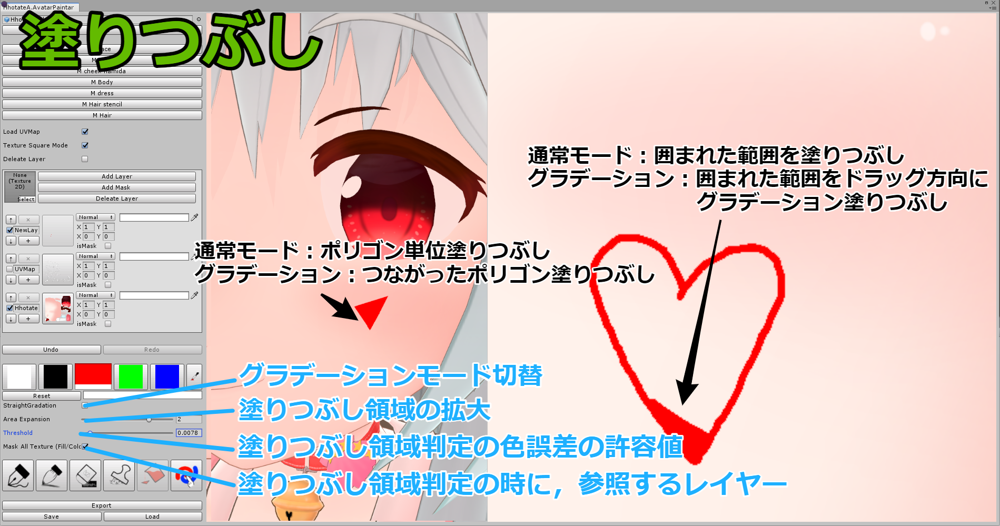
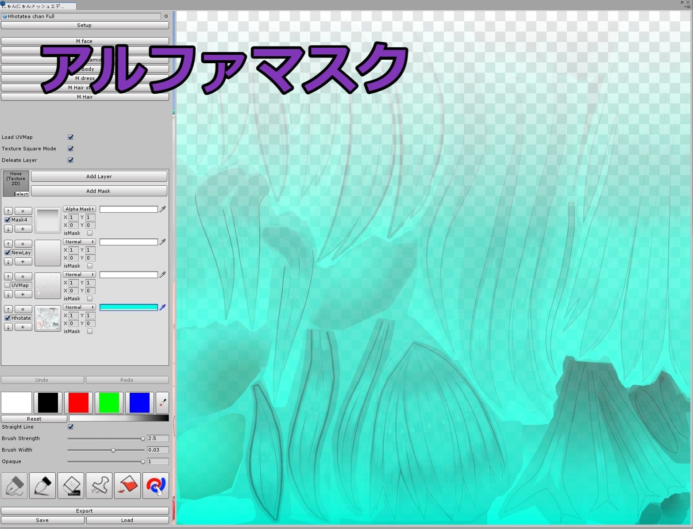

# NyanNyan Avatar Painter (TextureModifyTool)

This is a tool for simple texture editing in Unity's Editor for modifying the colors of avatars for VRChat.

## Import method, using the hand smooth
1. Make a backup of your avatar upload project in advance.
2. Import TextureModifyTool.unitypackage into UnityProject.
3. Open Window/HhotateA/NyanNyan Avatar Painter (TextureModifyTool) in the top menu of Unity.
4. Drag and drop the avatar whose texture you want to edit and click "Setup".
5. Click on the name of the material you wish to edit.
6. Select the editing tool.
7. Coloring avatars or textures.
8. Click on the "Export" button to export the textures.
9. "Save"/"Load" to save/load your work with layer information

## Caution
- If the window is buggy, close it once. Your edits will be lost, but they will usually be restored. (Remember to make a backup of your edits beforehand.)
- Since this tool was created in ToMe, it may not be maintained very often.
- Operation may be heavy in its own way

## Function Description

Avatar Canvas : Scale by mouse wheel, rotate by right-click and hold, move by mouse wheel
Texture Canvas : Scale by mouse wheel, move by mouse wheel long-press

- Material List : List of editable materials. Materials that do not have a main texture ("_MainTex") will not appear in the list.

- LoadUVMap : Option to load UVMap of the model during "Setup
- TextureSquareMode : If enabled, the avatar canvas will be deformed so that the texture canvas in the right side area of the window is square. Otherwise, the texture canvas and the avatar canvas will occupy half of the right side of the window.

- Layer List : This is the list of layers being edited. In the initial state, the original texture, UVMap, and a new layer for editing are registered in order from the bottom.
- AddLayer : Create a new layer. If a texture is registered in the left field, it is added as a new texture.
- AddMask : Add a layer with mask setting (Override/isMask). If a color palette gradient has been set, a mask of that color is created.

- Undo : Redo editing.
- Redo : Undo the Undo

- Color Palette : You can select a pen color. Click the selected palette again to edit the color.
- Eyedropper tool : You can get the pen color from the texture/layer you are editing.

- Export : Export the edited texture as an image.
- Save : Save the edited texture with layer information in layersavedata.asset(LayersSaveData:ScriptableObject) format.
- Load : Restore the edited layer information from layersavedata.asset(LayersSaveData:ScriptableObject) format file.

## Pen Settings

### Dropper Tool
 The currently selected color in the color palette can be extracted from the texture being edited.

- Read All Layers : If disabled, the colors are extracted only from the currently edited layer.

### Normal pen, watercolor pen, eraser
 This is the usual tool for applying color to textures.
 After selecting a color in the color palette, left-click to draw a line on the avatar canvas or texture canvas.

- StraightLine : This mode allows you to draw a straight line from the start point of the drag to the end point.
- BrushStrength : The hardness of the line. A low value produces a watercolor-like line with a thin outer edge. A high value produces a line with a clear border, like that of an oil pen.
- BrushWidth : The thickness of the line. 0 means a line with a thickness of 1 pix.
- Opaque : If 0, the transparency overlaps within the layer; if 1, the pen overwrites the layer transparency.

### stamp
 This tool allows you to paste your favorite image as a stamp. You can also copy a part of the texture you are editing as a stamp.
 Left-click to stamp on the avatar canvas or texture canvas.

- Texture : An arbitrary texture to be applied as a stamp.

- Copy : This mode copies a portion of the texture being edited as a stamp. Drag the desired area of the texture canvas from the start point to the end point.
- Paste : Paste the stamp onto a layer.

- Copy All Layers : If disabled, only the layer being edited is referenced when "Copy" is performed.

- Aspect Ratio : The aspect ratio of the stamp. It is automatically set when a texture is referenced.
- Size : The size of the stamp. It is automatically set when the texture is referenced.
- Rotation : Rotate the stamp.

### fill (in graphics)
 Fills the area of the texture canvas with the same color as the clicked area. StraightGradation" mode fills the area with a gradient in the direction of the drag.
 Fills the clicked polygon of the avatar canvas with the same color. StraightGradation" mode fills all polygons connected to the dragged polygon.

- Straight Gradation : Option to enable "StraightGradation" Mode.
- Area Expansion : Expands the fill area.
- Threshold : The color error to be tolerated when determining the fill area.
- Mask All Texture : If disabled, only the layer being edited is referenced when determining the fill area.

### graffiti
 Blur and blend the border of the pen or stamp.
 Left-click on the area of the texture canvas that you want to blur to blur it.

- BrushStrength : The hardness of the blur pen.
- BrushWidth : The thickness of the blur pen.
- Blur Power : The strength of the blur.

## Layer Settings

- Texture : If you want to add an image as a new layer, refer to it here.
- Add Layer : Create a new layer. (Normal)
- Add Mask : Creates a new layer with mask settings. (Disable, isMask)

### About the mask layer (isMask)
 If there is a layer with isMask set, all layers above it are affected by the mask layer.
 If you want to reset the mask layer, add a mask filled with white (Disable isMask) and add a layer above it.

### Settings for each layer type

- Disable : Disable
- Normal : Normal Composite
- Additive : Additive composition
- Multiply : Multiply Composite
- Subtraction : Subtraction composite
- Division : Division Composite
- Bloom : Luminous layer
   Intensity : Light intensity
   Threshold Threshold to start light
- HSV : Color transformation mask layer (HSV)
   H,S,V Hue, Saturation, Lightness
- Color : Color transformation mask layer (Color to Color)
   From Color before conversion
   To Color after transformation
   Brightness Blends the converted color.
   Threshold : Threshold of color transformation
- AlphaMask : Override mask layer
- Override : Override layer (ignore lower layer)

